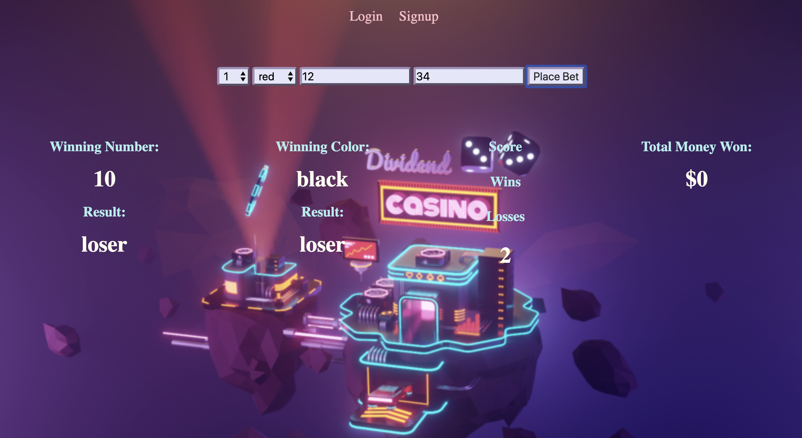
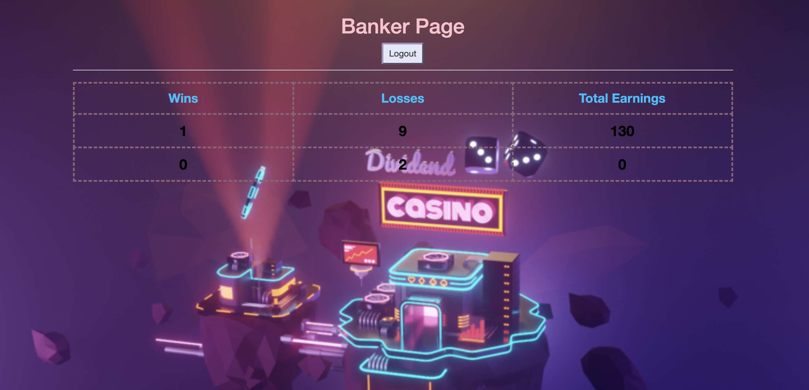

# Roulette App

## Goal:

Create roulette app where user can place a bet on the color and a number.
Banker can login and see score table and how much money he made.

## How It's Made:

**Tech Used**:

1. HTML, CSS, JavaScript, Node, Express, EJS template, MongoDB.
2. User Authentication: Passport User Authentication.

## Installation

1. Clone repo
2. run `npm install`

## Usage

1. run `node server.js`
2. Navigate to `localhost:8080`

## Credit

Modified from Scotch.io's auth tutorial
